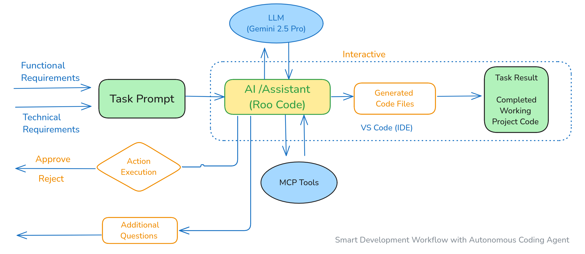

# AI-powered-Development
Projects develop using autonomous coding agent workflow

# Workflow

# Projects

## 1. LightRAG MCP Server (complete)
[LightRAG MCP Server](lightRAG_MCP_Server)
### Toolsets
VS Code + Roo Code + Gemini 2.5 Pro
### Project Prompt
[Project Prompt](lightRAG_MCP_Server/project_prompt.md)

## 2. Tariff News MCP Server (complete)
[Tarrif News MCP Server](tariff-news-server)
### Toolsets
VS Code + Roo Code + Gemini 2.5 Pro
### Project Prompt
[Project Prompt](tariff-news-server/project_prompt.md)

## 3. Referral Code Generator (complete)
[Referral Code generator](referral_app)
### Toolsets
VS Code + Roo Code + Gemini 2.5 Pro
### Project Prompt
[Project Prompt](referral_app/project_prompt.md)

## 4. Foreign Currency Exchange MCP Server(complete)
[forex_mcp_server](forex_mcp_server)
### Toolsets
VS Code + Roo Code + Gemini 2.5 Pro
### Project Prompt
[Project Prompt](forex_mcp_server/project_prompt.md)

## 5. Stock Analyst MCP Server(complete)
[stockanalyst_mcp_server](stockanalyst_mcp_server)
### Toolsets
VS Code + Roo Code + Gemini 2.5 Pro
### Project Prompt
[Project Prompt](stockanalyst_mcp_server/project_prompt.md)

## 6. OpenAI Agent-SDK UI Web App (complete)
[openai-visual-workflow](openai-visual-workflow)
### Toolsets
VS Code + Roo Code + Gemini 2.5 Pro
### Project Prompt
[Project Prompt](openai-visual-workflow/project_prompt.md)

