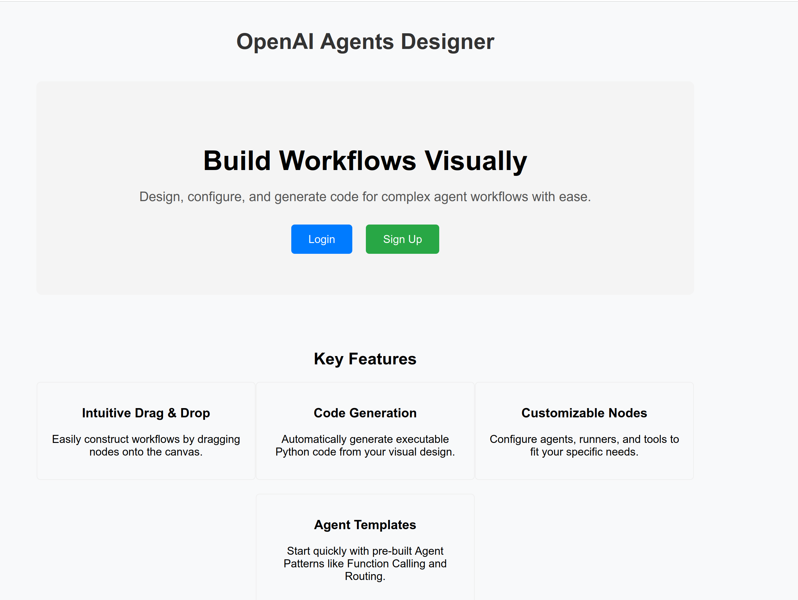
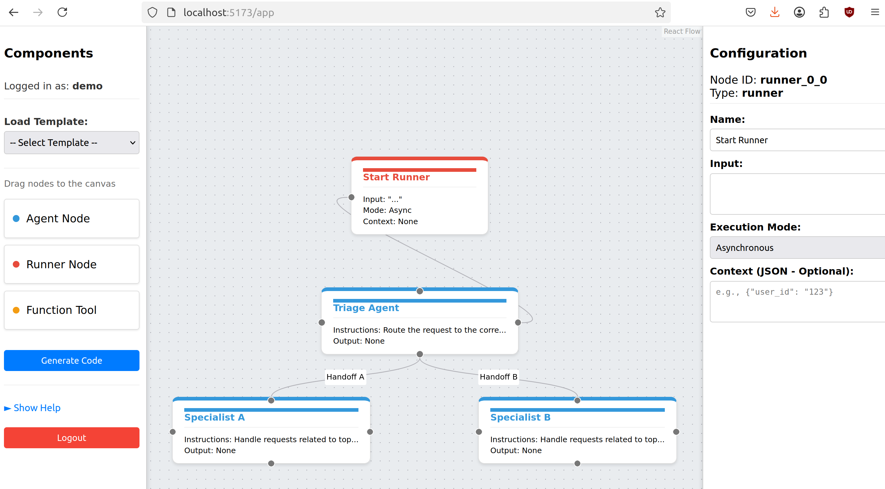
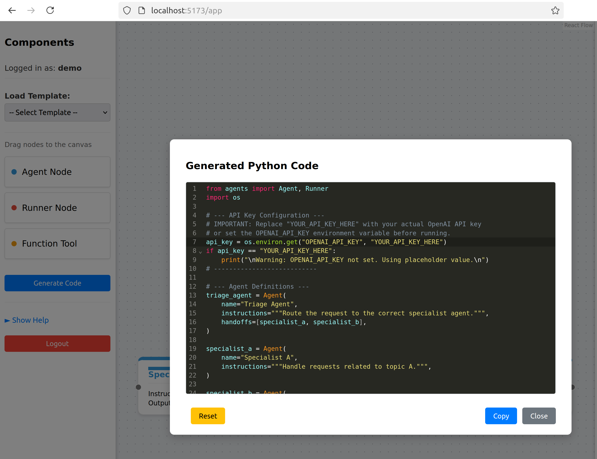
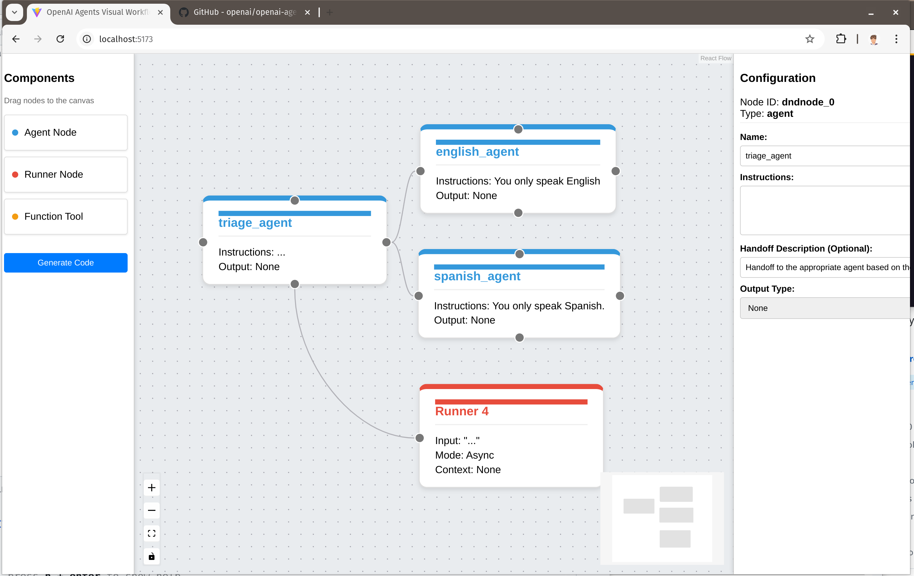
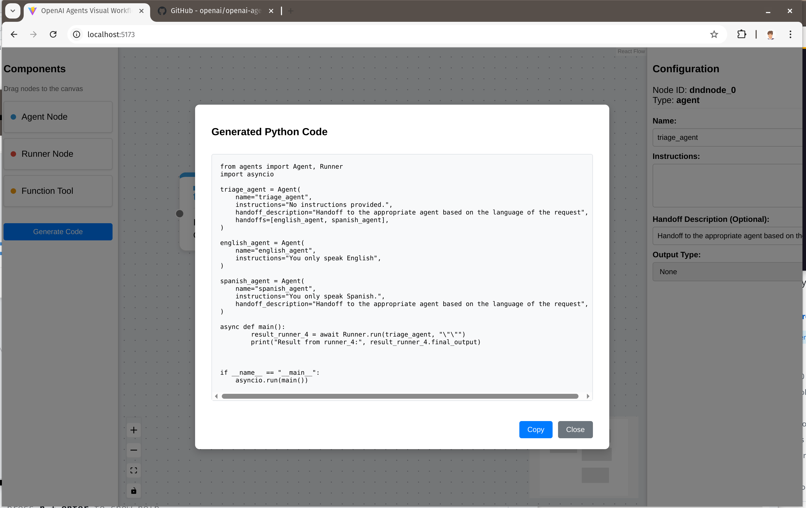
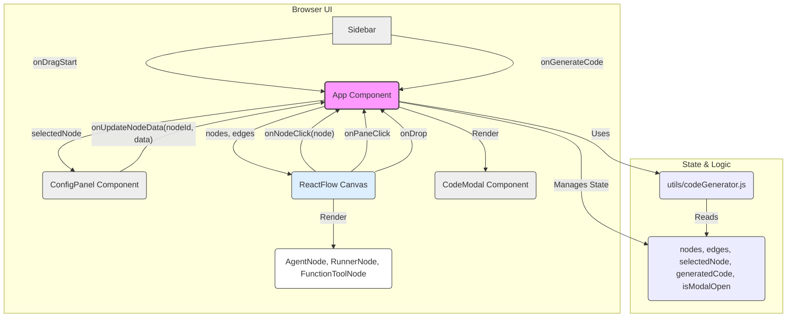

# OpenAI Agents Visual Workflow Designer

This project provides a web-based visual editor for designing OpenAI Agent workflows. Users can drag and drop components representing Agents, Runners, and Function Tools onto a canvas, configure their properties, connect them to define relationships (like handoffs or tool usage), and generate the corresponding Python code using the `openai-agents` SDK.







## Features

- **Visual Workflow Design:** Drag-and-drop interface for building agent workflows.
- **Node Types:** Supports core `openai-agents` components:
    - **Agent Node:** Represents an `Agent` instance. Configure name, instructions, handoff description, and output type.
    - **Runner Node:** Represents `Runner.run` or `Runner.run_sync`. Configure input, execution mode (Async/Sync), and context.
    - **Function Tool Node:** Represents a function decorated with `@function_tool`. Configure name, return type, and implementation.
- **Node Configuration:** Select nodes on the canvas to edit their specific properties in a dedicated side panel.
- **Connections:** Visually connect nodes to represent handoffs, tool usage, and execution flow.
- **Code Generation:** Generate a Python script based on the visual workflow, including necessary imports, function definitions, agent instantiations, and runner execution code.
- **Code Preview:** View the generated Python code in a modal with a copy-to-clipboard feature.

## Screenshots

**Canvas View:** Shows the main editor interface with nodes connected.


**Code Generation Modal:** Shows the modal displaying the generated Python code.


*(Note: Ensure the image files `visual_openai_agent_canvas.png` and `visual_openai_agent_code_gen.png` are present in the project root directory for these images to display correctly.)*

## Architecture Diagram



*(This diagram can be rendered by Mermaid-compatible Markdown viewers or online tools like the [Mermaid Live Editor](https://mermaid.live).)*

## Installation

1.  **Clone the repository (if applicable):**
    ```bash
    # git clone <repository-url>
    # cd openai-visual-workflow
    ```
    *(Assuming you are already in the `openai-visual-workflow` directory)*

2.  **Install dependencies:**
    Requires Node.js and npm (or yarn).
    ```bash
    npm install
    ```
    or
    ```bash
    # yarn install
    ```

## Usage

1.  **Start the development server:**
    ```bash
    npm run dev
    ```
    This will typically start the application on `http://localhost:5173` (or the next available port). Open this URL in your web browser.

2.  **Design Workflow:**
    - Drag node types (Agent, Runner, Function Tool) from the left sidebar onto the central canvas.
    - Click on a node on the canvas to select it.
    - Configure the selected node's properties using the form in the right-hand configuration panel. Changes are saved automatically.
    - Connect nodes by clicking and dragging from a source handle (small circle on node border) to a target handle on another node.

3.  **Generate Code:**
    - Once your workflow is designed, click the "Generate Code" button in the left sidebar.
    - A modal window will appear displaying the generated Python script.
    - Use the "Copy" button in the modal to copy the code to your clipboard.
    - Close the modal using the "Close" button or by clicking the overlay.

## Project Structure

- `index.html`: Main HTML entry point.
- `style.css`: Global CSS styles.
- `src/main.jsx`: React application entry point, renders `App`.
- `src/App.jsx`: Main application component, handles layout, state management, and React Flow setup.
- `src/components/`: Contains reusable UI components:
    - `Sidebar.jsx`: Left panel with draggable nodes.
    - `ConfigPanel.jsx`: Right panel for node configuration.
    - `CodeModal.jsx`: Modal for displaying generated code.
    - `nodes/`: Contains custom React Flow node components (`AgentNode.jsx`, `RunnerNode.jsx`, `FunctionToolNode.jsx`).
- `src/utils/codeGenerator.js`: Logic for generating Python code from the React Flow state.
- `vite.config.js`: Vite build configuration.
- `package.json`: Project dependencies and scripts.


## Built With

- [React](https://reactjs.org/)
- [Vite](https://vitejs.dev/)
- [React Flow](https://reactflow.dev/)