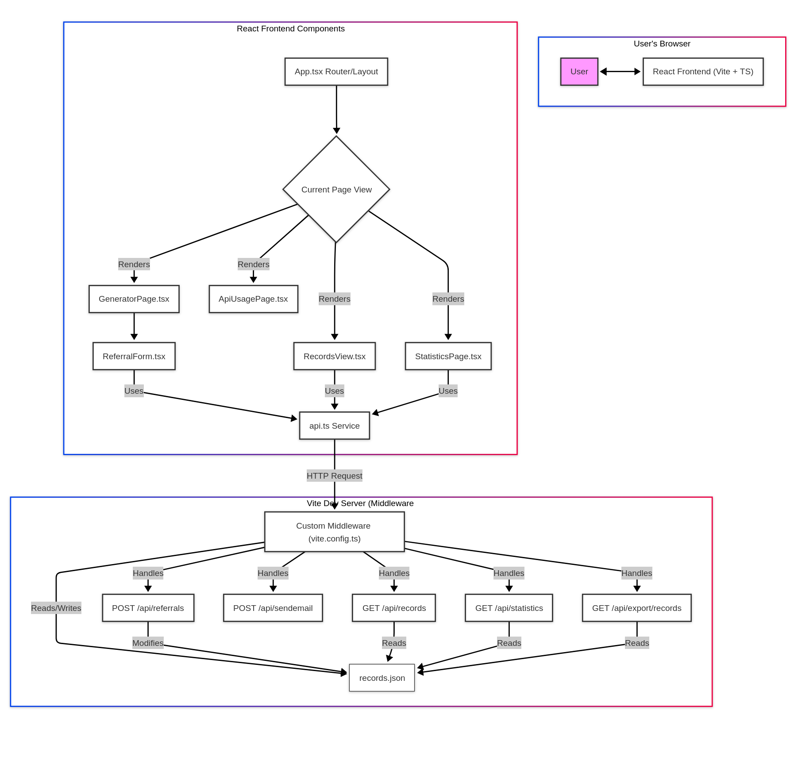

# Referral Code Generator App

This is a simple React application built with Vite and TypeScript that allows users to input company and contact details to generate a referral code via an API call.

## Design


## Features

*   Form for submitting referral information (Company Name, Industry, Contact Name, Email, Phone).
*   Client-side validation using `react-hook-form`.
*   API integration to submit form data and receive a referral code.
*   Basic UI styling with Tailwind CSS.
*   [Solution Architecture Diagram](./referral_app_architecture.md)

## Prerequisites

*   **Node.js:** Version 18.x or later recommended. Download from [https://nodejs.org/](https://nodejs.org/)
*   **Package Manager:** npm (comes with Node.js), yarn, or pnpm.

## Installation

1.  **Clone the repository (if applicable):**
    ```bash
    # Replace with the actual repository URL if you have one
    # git clone <repository-url>
    # cd referral_app
    ```
    If you already have the code locally, navigate to the `referral_app` directory in your terminal.

2.  **Install dependencies:**
    Using npm:
    ```bash
    npm install
    ```
    Or using yarn:
    ```bash
    yarn install
    ```
    Or using pnpm:
    ```bash
    pnpm install
    ```

## Running the Development Server

Once dependencies are installed, you can start the local development server:

Using npm:
```bash
npm run dev
```
Or using yarn:
```bash
yarn dev
```
Or using pnpm:
```bash
pnpm dev
```

This will typically start the application on `http://localhost:5173` (or the next available port). Open this URL in your web browser to view the application. The server supports Hot Module Replacement (HMR), so changes you make to the code should reflect automatically in the browser without a full page reload.

## API Documentation

This application uses a simulated backend API during development. Documentation for the available API endpoints (including request/response formats and examples) can be found within the running application itself:

1.  Start the development server (`npm run dev`).
2.  Navigate to the **API Docs** tab in the application's UI (usually at `http://localhost:5173/apiusage`).

The available endpoints are:
*   `POST /api/referrals`: Generate a new referral code.
*   `GET /api/records`: Retrieve all generated records.
*   `POST /api/sendemail`: Simulate sending a code via email.
*   `GET /api/statistics`: Retrieve calculated usage statistics.
*   `GET /api/export/records`: Download all records as a CSV file.

## Building for Production (Optional)

To create an optimized production build:

Using npm:
```bash
npm run build
```
Or using yarn:
```bash
yarn build
```
Or using pnpm:
```bash
pnpm build
```

This command will generate static assets in the `dist` directory, which can then be deployed to a web server or hosting platform.

## Available Scripts

In the project directory, you can run:

*   `npm run dev` / `yarn dev` / `pnpm dev`: Starts the development server.
*   `npm run build` / `yarn build` / `pnpm build`: Bundles the app into static files for production.
*   `npm run lint` / `yarn lint` / `pnpm lint`: Lints the code using ESLint.
*   `npm run preview` / `yarn preview` / `pnpm preview`: Serves the production build locally for previewing.
