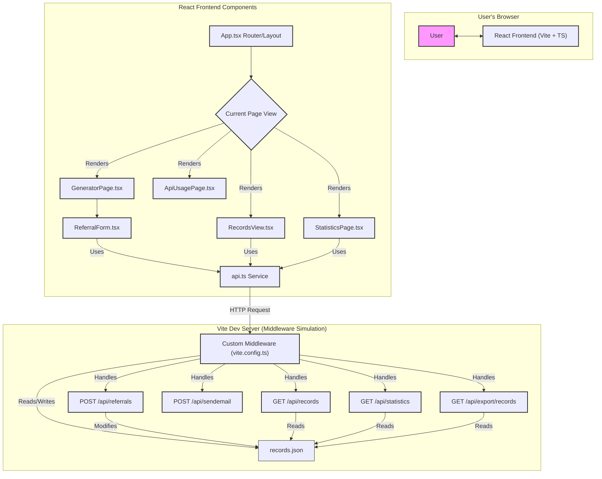

# Referral App Architecture (Updated)

This diagram shows the components and flow of the Referral Code Generator application, including the simulated backend via Vite middleware.

**Explanation:**

1.  **User's Browser:** The user interacts with the React frontend.
2.  **React Frontend:** Built with Vite, React, and TypeScript.
    *   `App.tsx`: Handles routing and main layout (Title, Logo, Navigation).
    *   Renders different page components based on the route: `GeneratorPage`, `RecordsView`, `ApiUsagePage`, `StatisticsPage`.
    *   Page components use the `api.ts` service module to interact with the backend simulation.
    *   `ReferralForm.tsx` handles user input for generating codes.
3.  **Vite Dev Server (Middleware Simulation):**
    *   A custom Vite plugin injects middleware defined in `vite.config.ts`.
    *   This middleware intercepts requests to specific `/api/*` paths.
    *   It handles GET and POST requests for records, referrals, email simulation, statistics calculation, and CSV export.
    *   It reads from and writes to `records.json` to persist data during development.

**Flow:**

*   The user navigates the React app via links handled by `App.tsx`.
*   Frontend components (via `api.ts`) make HTTP requests (GET/POST) to paths like `/api/records`, `/api/referrals`, etc.
*   The custom middleware in `vite.config.ts` intercepts these requests.
*   The middleware performs the necessary actions (reading/writing `records.json`, calculating stats, formatting CSV) and sends back the appropriate JSON or CSV response.