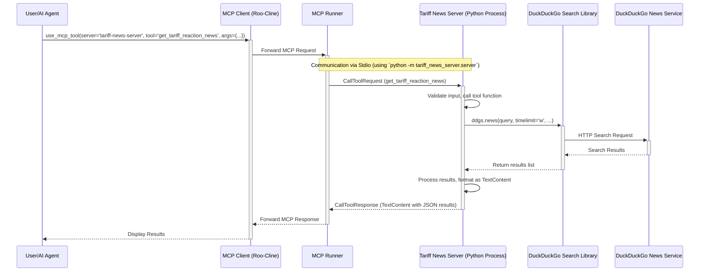

# Tariff News MCP Server
The MCP server `tariff-news-server` has been updated to support both stdio and SSE transports, selectable via a command-line argument. The necessary dependencies and code structure are in place. The server should start correctly in either mode, and the `get_tariff_reaction_news` tool is available.

## Installation 

Download code
```
git clone https://github.com/minyang-chen/AI-powered-Development.git
cd tariff-news-server
pip install -r requirements.txt
pip install -e .
```
Run transport stdio 
```
python -m tariff_news_server.server
```
Run  transport  sse
```
python -m tariff_news_server.server --transport sse
```

## mcp_settings.json
```
{
  "mcpServers": {
    "tariff-news-server": {
      "command": "python",
      "args": [
        "-m",
        "tariff_news_server.server"
      ],
      "env": {},
      "disabled": false,
      "alwaysAllow": []
    }
  }
}
```

# Toolstack
```
VS Code
Roo Code
MCP Python SDK
Google Gemini 2.5 Pro
```

Here is the final updated requirements summary reflecting the added SSE support:

# Requirements Prompt

---

**Revised Project Requirements: Tariff News MCP Server (v2 - with SSE Support)**

**Project Goal:**
Create a Python-based MCP server that provides a tool to search for recent news articles concerning international reactions to the US tariffs announced in April 2025, supporting both stdio and SSE transports.

**1. Business Requirements:**

*   The server should enable users (or AI agents) to query for news articles about how different countries are reacting to the specified US tariffs.
*   The focus should be on retrieving relevant news published within the last week.
*   The server should be packaged for easy distribution and installation using pip.

**2. Technical Requirements:**

*   **MCP Server Implementation:**
    *   Implement using the `mcp` Python SDK (package name: `mcp`).
    *   Support both standard I/O (`stdio`) and Server-Sent Events (`sse`) transport mechanisms, selectable via a `--transport` command-line argument.
    *   Employ the decorator-based API (`@mcp_server.list_tools`, `@mcp_server.call_tool`) provided by `mcp.server.lowlevel.Server`.
    *   Use `click` for command-line argument parsing (`--transport`, `--port`).
    *   Use `starlette` and `uvicorn` to handle the web server component for SSE transport.

*   **Core Tool (`get_tariff_reaction_news`):**
    *   **Functionality:** Searches the internet using the DuckDuckGo search engine (`duckduckgo-search` library) for news articles related to tariff reactions.
    *   **Search Query Construction:**
        *   Base query: "reactions to US tariffs April 2025"
        *   If `country` input is provided: "reactions from [Country Name] to US tariffs April 2025"
        *   Append `additional_keywords` if provided.
    *   **Filtering:** Limit search results to news published within the last week (using `timelimit='w'` with `duckduckgo-search`).
    *   **Ranking:** Default DuckDuckGo relevance/ranking.

*   **Tool Schemas (using Pydantic):**
    *   **Input (`GetTariffReactionNewsInput`):**
        *   `country`: `Optional[str]` - The specific country to focus the search on.
        *   `additional_keywords`: `Optional[str]` - Extra terms to add to the query.
    *   **Internal Output Models:**
        *   `SearchResultItem`: Defines the structure for a single result (`title`, `url`, `snippet`, `source`, `published_date`).
        *   `SearchSuccessOutput`: Contains a `list[SearchResultItem]` on success.
        *   `SearchErrorOutput`: Contains an `error: str` field on failure.
    *   **MCP Tool Return Type:** The `@mcp_server.call_tool` decorated function will return `list[mcp.types.TextContent]`. The `SearchSuccessOutput` or `SearchErrorOutput` models will be serialized into the `text` field of the `TextContent` block. Tool execution errors should be raised as standard Python exceptions (e.g., `ValueError`, `Exception`), which the `mcp` library will format into MCP error responses.

*   **Dependencies:**
    *   `mcp[cli]>=1.6.0`: For MCP server/tool implementation and types.
    *   `duckduckgo-search>=2025.4.1`: For executing the web search.
    *   `pydantic>=2.11`: For defining input/output schemas and validation.
    *   `anyio>=4.0`: Required by the `mcp` library for running the asynchronous server via stdio.
    *   `click>=8.0`: For command-line argument parsing.
    *   `starlette>=0.27`: For SSE transport web framework.
    *   `uvicorn[standard]>=0.23`: For running the Starlette application.
    *   `requests>=2.25`: (Included but not directly used).

*   **Development Environment:**
    *   Use a Python virtual environment (e.g., `venv`) to manage dependencies.
    *   Include a `requirements.txt` file (generated via `pip freeze`).

*   **Packaging:**
    *   Use a `pyproject.toml` file with a `setuptools` build backend to make the server installable via `pip`.
    *   Include a console script entry point (`tariff-news-server`) that runs the main CLI function (`main_cli`).

*   **Code Structure:**
    *   Organize code logically (e.g., `schemas.py`, `tool.py`, `server.py` within a `src/tariff_news_server` package).

*   **Execution:**
    *   **Stdio (Default):** Run via `python -m tariff_news_server.server` or `tariff-news-server` (if installed). Configure in MCP settings using the `python -m ...` command.
    *   **SSE:** Run via `tariff-news-server --transport sse [--port <port>]`. Configure in MCP settings using the console script command and arguments, or as a remote SSE server pointing to the correct URL (e.g., `http://localhost:8000/mcp/sse`).

**3. Useful Resources (Original Links):**

*   Python MCP SDK (`mcp` package): [https://github.com/modelcontextprotocol/python-sdk](https://github.com/modelcontextprotocol/python-sdk)
*   Example MCP Servers: [https://github.com/modelcontextprotocol/python-sdk/tree/main/examples/servers](https://github.com/modelcontextprotocol/python-sdk/tree/main/examples/servers) (Specifically, `simple-tool` provides a relevant pattern).

---


## Solution Diagram

I have generated a Mermaid sequence diagram illustrating the solution architecture for the Tariff News MCP Server. The diagram shows the interaction between the user, the MCP client, the MCP runner, the Python server process, the DuckDuckGo search library, and the external DuckDuckGo service to fulfill a tool request.

